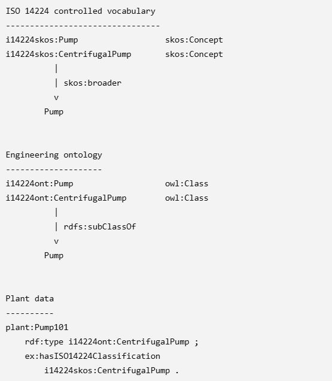

# SKOS versus RDF for taxonomies

We want the a taxonomy developed by a specified organisation to be clearly linked to that organisation. For example what terminology is in the ISO 14224:2023 standard and how is it defined, grouped, and related to other terms.

The view of the world captured by ISO 14224 is intended for maintenance and reliability engineers who want to represent data, often held in CMMS, in a standard fashion. What is captured and how it is structured and grouped is not necessarily the same as what design engineers use (e.g. CFIHOS) and other disciplines (e.g DEXPI). 

The challenge is having two taxonomy systems.

