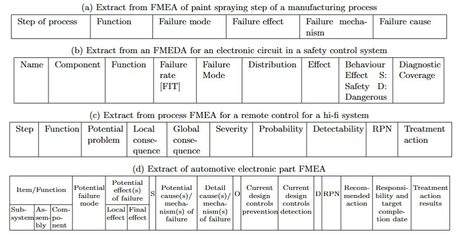

# GitHub repo for collaboration on developing a semantic version for ISO 14224 

A public repo for shared development of controlled vocabulary, linked data, RDF triple stores, and ontologies for ISO 14224 users

## Purpose

The purpose of this repo is to provide a shared space for work on semantic representation of knowledge held in industry data in in 1) failure modes and effects analysis tables, and 2) maintenance work order databases that reference failure descriptors (failure mode, failure mechanism) and the asset taxonomic structures codified in the ISO 14224:2016 standard.

## What is ISO 14224?

ISO 14224:2016 is a standard for the collection of reliability and maintenance (RM) data in a standard format for equipment in all facilities and operations. ISO 14224:2016 is widely used within the petroleum, natural gas and petrochemical industries during the operational life cycle of equipment and has also seen adoption in the mining industry.

ISO 14224 provides definitions that constitute a "reliability language" that can be useful for communicating operational experience. The failure modes defined in the normative part of this International Standard can be used as a "reliability thesaurus" for various quantitative as well as qualitative applications.

Standardization of data collection practices facilitates the exchange of information between parties, e.g. plants, owners, manufacturers and contractors. Controlled vocabularies and consistent interpretation of codes is increasingly recognized as a necessary foundation for enterprise generative AU models.

ISO 14224 provides categories for the following data:

a) equipment data, e.g. equipment taxonomy, equipment attributes;

b) failure data, e.g. failure cause, failure consequence;

c) maintenance data, e.g. maintenance action, resources used, maintenance consequence, down time.

There data are used for tracking and investigating reliability issues, calculating equipment and system availability, maintenance management metrics, and events with safety and environmental impacts.

## What is the problem?

Tables capturing failure-related data are often created and maintained ad hoc across teams, departments and organisations. Manual handling of large, unstandardised spreadsheets is time-consuming and error-prone, prompting interest from organisations in using automated and AI-based systems for querying this data.

## What is the opportunity?

There are several opportunities for a shared industry project to improve machine readability of FMEA and maintenance work order data that reference the ISO 14224 standard. In order of technical complexity from technically simple to complex these are

**Controlled vocabulary**: while some terms are provided in the terms and definitions section of the ISO 14224:2016: https://www.iso.org/obp/ui/en/#iso:std:iso:14224:ed-3:v2:en the standard lacks robust definitions for terms inside the document e.g. in the tables in Appendix B that describe failure modes and mechanisms. A mapping also needs to be done between terms that are common to ISO 14224:2016 and IEC 60812 IEC 60812:2018 Failure modes and effects analysis (FMEA and FMECA) and to document the differences.

Example
label:failure effect
natural language definition: process that is the consequence of failure, within or beyond the boundary of the failed item
example: leaking pipe, erratic operation, equipment does not run

Value
The business value of this step is that every organisation (and even engineers within an organisation) keep their own versions of ISO 14424 in database tables and Excel spreadsheets with their own entity type labels and column headings, as well as codes resulting in challenges for humans, let alone AI to determine if the terms are semantically the same.

**Linked data**: this would be a major step forward in providing a shared, open, stable and managed resource, such as a GitHub page that engineers could reference to ensure a shared interpretation of a term. Challenges include where to host it (neither ISO or IEC provide suitable namespaces and IRI hosting capabilities at present) and how to provide trust for enterprises on how it will be maintained, and how updates will be managed.

Example
Linked data for the term 'failure effect' https://spec.industrialontologies.org/iof/ontology/maintenance/Maintenance/FailureEffect

**Lightweight schemas based on semi-structured definitions**: providing semi-formal definitions based on a list of controlled terms (nodes and edges/ classes and object properties) clarifies the meaning of each term moving away from the ambiguity of natural language and towards machine interpretability. It provides the basis for a common schema.

Example
if x is a 'failure effect' then x is a 'process' that is 'preceded by' some 'failure event' or 'failure process'

In this example, the schema would need to contain concepts for 'process', 'failure event', 'failure process' and 'preceded by'

**RDF triple stores**

The ability to have data in the form of RDF triple stores allows for SHACL to be used for data quality checks. SPARQL can also be used to find and retrieve data with greater precision.

**Ontology modules**:

Ontologies go beyond schemas and provide a principled approach to defining concepts and their relations. To domain practitioners (such as the author of this readme) this can be achieved by alignment to a top-level ontology either directly or via ontology modules that are also aligned to a top-level ontology.

## Examples of data

FMEA table

| FMEA ID | Equip_ID  | ISO14224 FM code | ISO14224 FM descriptor | ISO14 Failure Mechanism |
|:--- |:--- |:--- |:---|:---|
|FMEA.001 | 001.GBOX | VIB | Vibration | Fatigue |
|FMEA.002 | 001.GBOX | STD | Structural deficiency | Breakage |
|FMEA.003 | 001.GBOX | VIB | Vibration | Wear |

MWO Maintenance Work Order table

| MWO ID | Equip_ID  | MWO text | ISO14224 FM code| ISO14224 FM descriptor |
|:--- |:--- |:--- |:---|:---|
|N200| 001.GBOX | gearbox vibrating | Vibration | VIB |
|N300 | 001.GBOX | leak in seal | External leakage - utility medium| ELU |

FMEA is a well-established and vital part of risk assessment in engineering. Industry standards like the ISO/IEC 60812 describe FMEA concepts and the possible ways spreadsheets can be set out. ISO14224 provides a set of classifications and codes widely used in oil and gas and mining. Despite the availability of these standards, the structure of these spreadsheets are highly variable and context-dependant. FMEA is often recorded in loosely-structured Excel spreadsheets with inconsistent use of terms. Both present issues for automated processing.

Below are examples from column headings for FMEA examples provided in ISO/IEC 60812 standard.

## Examples of competency questions based on this data

### FMEA table management

Organisations have hundreds (if not thousands) of FMEA tables, if these are created and stored in Excel they can have wildly different column labels. Different software packages each have their own labels for terms in FMEA spreadsheets. There is a significant use case in being able to use modern AI tools to map these tables to a common semantic layer so that some of the following tasks can be done.

- Identify and fix inconsistencies - are the same FM codes/ effects/ mechanism descriptors being used for identical equipment?

- Are FM codes/ effects/ mechanism descriptors being used at appropriate levels in equipment class (functional location) hierarchies?

- Map synonyms to agreed controlled vocabulary

- Use Linked Data to reduce ambiguity for AI tools and humans

### Quality control of failure mode assignment in MWOs

It is common practice to assign a FM code based on ISO 14224 (or a derivative) to each maintenance notification associated with a failure event or observation of failure process. The consistency of application of these FM codes is very difficult in large organisations but it is possible with modern AI tools to post process MWO data and improve the quality of FM code assignment. The effectiveness of these AI tools would be improved, initially through a move to Linked Data, then quality control though SHACL, and in the long term using the reasoning ability of ontologies. 

### Reconciliation of failure mode assignment in MWOs with what is in FMEAs to improve equipment maintenance strategy

One of the holy grails for Maintenance Managers is to be able to confirm equipment maintenance strategies are correct. Vast sums of money are spent on the execution of maintenance strategies whether they are working or not. Lagging indicators of maintenance strategy effectiveness include equipment availability, unplanned outages, maintenance costs and safety incidents. After unplanned outages it is common for reliability engineers to examine the maintenance strategy to see if the failure event that occurred was a) identified in the FMEA, 2) had a suitable control activity, and 3) if the control activity was actioned. Other actions include trawling through old MWOs to see if similar events had happened in the past. All of these activities could be assisted by AI tools but only if these tools can be certain what data are looking at. Again this will be assisted by a move to Linked Data, then quality control though SHACL, and in the long term using the reasoning ability of ontologies.

## More thoughts on ontologies and ISO 14224

In the opinion of this author, in engineering domain there are four ontologies to be considered as follows
- Basic Formal Ontology (BFO)
- Industrial Data Ontology (IDO)
- DOLCE
- Unified Foundational Ontology (UFO)

It should be possible to represent concepts in ISO 14224 in each of these frameworks.

A key step in ontology development and in assessing fitness for purpose is to have data and competency questions. One of the goals of this repo is to provide these. 

Ontologies are very expensive to develop and maintain and if they cannot demonstrate business value, that is a problem.

Some of the key ontological modelling challenges are:

1. Data on the 'failure event', 'failure mode' and 'failure mechanism' is captured in tables that represent quite different interpretations.

a. 'Potential generic failure event' - something that might happen to a class of equipment (e.g as documented in ISO 14224 tables)
b. 'Potential failure event' - something that might happen to a specific instance of equipment (e.g. in a FMEA table for a specific instance of equipment)
c. 'Actual failure event' - something that has happened to a specific instance of equipment (e.g. in a maintenance work order table)

The labels used in tables found in enterprise data systems do not distinguish between these. An engineer 'knows' what the context is from what else is in the table e.g. is it a FMEA or MWO table.

2. Actual failure events have to be observed in order to know they have occurred but they can occur without being observed. In engineering these are called hidden failures. Actual failure effects are only recorded once they have been observed.

3. One of the most widely used definitions of reliability is ``the probability that an item performs its required function (without failure) under stated conditions for a specific period of time''. An item can be a single component or an entire system. The number of required functions is seldom completely documented (especially when generic FMEA templates are used) and stated conditions are often under-specified. 

