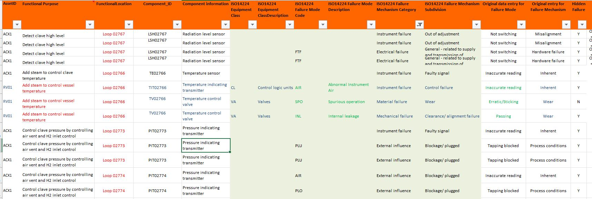

ISO 14224 FMEA failure-mode code compliance checker

# Purpose
-------
Checks an Excel FMEA worksheet for rows where the ISO 14224 failure mode (FM) code is:
  1. is the FM code missing,
  2. not in the ISO 14224 Annex B failure-mode code list, or
  3. a valid ISO 14224 code, but not allowed for the row's equipment class.

**Test 1** was run on Melinda's laptop using ChatGPT. Her ChatGPT has a history of her work with ISO 14224. In Test 1 the LLM was given the raw Excel spreadsheet of FMEA data and tables from ISO 14224 in PDF form.

In **Test 2**, also run on Melinda's laptop using her ChatGPT, the LLM was given the same raw Excel spreadsheet of FMEA data but the information from the tables was provided a Python code.

```
ISO14224_ALL_FM_CODES = {
    # common rotating/mechanical/electrical/safety/subsea/drilling codes
    "AIR", "BRD", "BRO", "CLW", "DOP", "ELF", "ELP", "ELU", "ERO",
    "FCO", "FDC", "FOF", "FOV", "FTC", "FTD", "FTF", "FTI", "FTL", "FTO",
    "FTS", "HIO", "IHT", "INL", "LBP", "LCP", "LOA", "LOB", "LOO", "LOR",
    "MOF", "NOI", "NOO", "NON", "OHE", "OTH", "PCL", "PDE", "PLU", "POD",
    "POW", "PTF", "SER", "SET", "SHH", "SLL", "SLP", "SPO", "STD", "STP",
    "UNK", "VIB", "VLO", "WGL",
}
```

**Test 3** was the same as Test 2 but was run on a different laptop with another person's ChatGPT which did not have any ISO 14224 history.


### The FMEA Excel spreadsheet

The spreadsheet contains FMEA data from an actual plant. The table has inconsistent use of colour and formats. An extract is shown below.



## Summary of results

| Experiment                                                                                         | 1  | 2  | 3  |
|-----|----|----|----|
| No. of rows analysed         66 | 66 | 66 |
| Rows with missing/non-compliant/unsupported code    | 33 | 33 |    |
| Rows with FMEA FM code provided      |    |    | 54 |
| Non-compliant rows      |    |    | 25 |
| FM code not in the ISO 14224 FM code list           | 2  | 2  | 2  |
| FM code not permitted for resolved equipment class       | 19 | 19 | 5  |
| Missing ISO 14224 failure mode code        | 12 | 12 | 12 |
| Missing/ unrecognised ISO equipment class           |    |    | 18 |
| FM code is valid in ISO 14224 but not shown for equipment class 'Control logic units' in Table B.9 | 2  | 2  |    |
| FM code is valid in ISO 14224 but not shown for equipment class 'Input devices' in Table B.9       | 14 | 14 |    |
| FM code is valid in ISO 14224 but not shown for equipment class 'Valves' in Table B.9   | 3  | 3  | 3  |

### Results 

**Question 1. is the FM code missing?**
Tests 1 and 2 gave the correct answer (12). Test 3 did not provide an answer.

**Question 2. is the FM code not in the ISO 14224 Annex B failure-mode code list?**
Correct answer in all 3 tests

**Question 3. is the FM code a valid ISO 14224 code, but not allowed for the row's equipment class?**
Tests 1 and 2 addressed this correctly for all 3 equipment classes represented in the FMEA spreadsheet (Control logic units, input devices and valves). Test 3 only reported on Valves.

## Lessons learned

ChatGPT was surprised me with what it could do BUT it performed very differently on my computer compared to my husband's computer. The history built up by my work on the ISO 14224 ontology using ChatGPT is the only variant here. 

# Correct answers

The answers are as follows and correct

Total FMEA rows checked 66

Rows with missing/non-compliant/unsupported code 33

| Issue type | Count | Basis |
|------------|-------|-------|
| FM code is not in ISO 14224 Annex B failure mode code list | 2 |ISO 14224 Annex B Table B.9 and Tables B.6-B.12 code list |
| FM code is valid in ISO 14224 but not shown for equipment class 'Control logic units' in Table B.9| 2 |ISO 14224 Annex B Table B.9 and Tables B.6-B.12 code list |
| FM code is valid in ISO 14224 but not shown for equipment class 'Input devices' in Table B.9 | 14 |ISO 14224 Annex B Table B.9 and Tables B.6-B.12 code list |
| FM code is valid in ISO 14224 but not shown for equipment class 'Valves' in Table B.9 | 3 | ISO 14224 Annex B Table B.9 and Tables B.6-B.12 code list |
| Missing ISO 14224 failure mode code | 12 | ISO 14224 Annex B Table B.9 and Tables B.6-B.12 code list |
            


