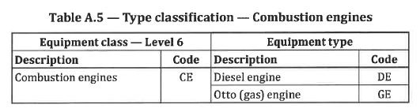
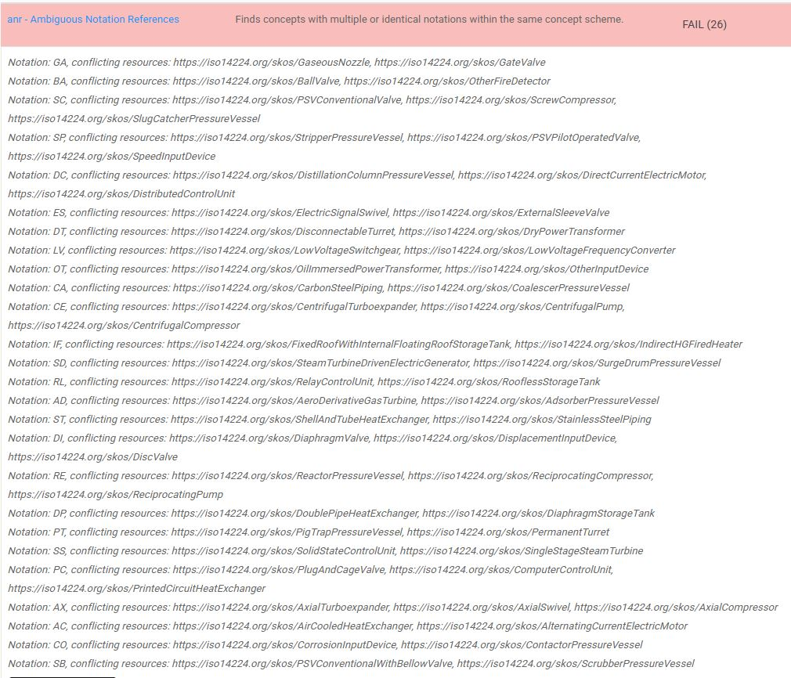
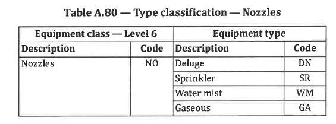
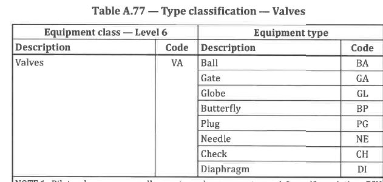

# Experiment 3 - check for duplicate equipment codes in ISO 14224 Appendix A

Appendix A.2 contains sections for each Equipment Class organised by the following section headings:

- A.2.2 Rotating equipment data
- A.2.3 Mechanical equipment
- A.2.4 Electrical equipment 
- A.2.5 Safety and control
- A.2.6 Subsea (note the skos files and this experiment do NOT include data for subsea equipment)

Examples of Equipment Classes include A.2.2.1 Combustion Engines, A.2.2.2 Compressors and so on. 

The term Equipment Class is defined in Clause 3 of the Standard and for this experiment is defined in a [TTL file](vocab14224_skos_basic.ttl) as follows.

```
i14224skos:EquipmentClass a skos:Concept ;
    skos:altLabel "equipment category"@en ;
    skos:definition "class of similar type of equipment units"@en ;
    skos:example "e.g. pumps "@en ;
    skos:inScheme i14224skos:StandardISO14224;
    skos:prefLabel "equipment class"@en ;
    skos:scopeNote ""@en .
```

In each Equipment Class section there is a Table - Type Classification.

This Table has two columns, one for 'Equipment class - Level 6' and the other for 'Equipment type'. Each column contains a Description and a Code as shown in the Figure below.



Note there are two digit codes for Level 6 and Level 7.

The information from these tables has been represented in SKOS format [in this file](iso14224_skos_ApA_level7_updated.ttl)

An example for the Combustion Engine is as follows:

```
### https://iso14224.org/skos/CombustionEngine
i14224skos:CombustionEngine
    a skos:Concept ;
    skos:prefLabel "Combustion engine"@en ;
    skos:broader i14224skos:RotatingEquipment ;
    i14224skos:mapsToTerm i14224skos:EquipmentClass ;
    i14224skos:taxonomicLevelNumber "Level 6" ;
    i14224skos:taxonomicClassificationLevel i14224skos:EquipmentUnit ;
    skos:notation "CE"^^i14224skos:AllowedISO14224EquipmentCodeLevel6 ;
    i14224skos:hasEquipmentCategory i14224skos:RotatingEquipment .
```

Each entry (at L6 and L7) has been given a skos:notation, in the above example this is `skos:notation "CE"^^i14224skos:AllowedISO14224EquipmentCodeLevel6'

In addition a list of rdf:value for i14224skos:AllowedISO14224EquipmentCodeLevel6 and i14224skos:AllowedISO14224EquipmentCodeLevel7 is created. 

## Test

When the [file](iso14224_skos_ApA_level7_updated.ttl) is run in a [SKOS checker](https://skos-play.sparna.fr/skos-testing-tool/) we get the following errors:

## Results

26 duplicate codes identified.



LOoking at the first error in the list  `Notation: GA, conflicting resources: https://iso14224.org/skos/GaseousNozzle, https://iso14224.org/skos/GateValve'

We can see from the pdf of the Standard (see screenshots below) that there is indeed DUPLICATION. Table A.80 shows code GA used for Gaseous Nozzle and Table A.77 GA is used for Gate Valve, both are codes at Level 7.





There are 25 other duplicate entries as well. 

## Comment

We do not know if this duplicate entries are considered allowed for these codes but the presence of these duplicate entries at Level 7 will cause issues when moving to machine-readable formats.

The ability of off-the-shelf SKOS format checkers to easily identify these issues is an advantage available to use when information in tables is represented as SKOS (and RDF) formats.