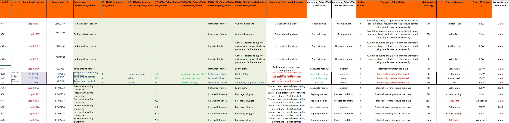

ISO 14224 FMEA failure-mode code compliance checker

# Purpose
-------
Checks an Excel FMEA worksheet for rows where the ISO 14224 failure mode (FM) code is:
  1. missing,
  2. not in the ISO 14224 Annex B failure-mode code list, or
  3. a valid ISO 14224 code, but not allowed for the row's equipment class.


# The Excel spreadsheet

The spreadsheet contains FMEA data from an actual plant. The table has inconsistent use of colour and formats. An extract is shown below.



# Test 1

In Test 1 ChatGPT was given the PDF of the FMEA tables from from ISO 14224 and the FMEA table as an Excel spreadsheet. The prompt was:
 - Here is a PDF from ISO 14224 standard
 - Here is an Excel worksheet for FMEA. Stand by for instructions
 - Identify each row in the Excel FMEA that has a FMEA code that is NOT compliant with ISO 14224. Check 1. the FM code list in ISO 14224 and 2. the tables showing which equipment class can have which FM code.
 - Can you export the code for this process

The output (OUTPUT_test1.xlsx) added 3 worksheets to the Excel file. 
-  A new sheet called ISO14224_Check.
This has a new col A with a row ID, changed names of several columns to more sensible names (eg from ISO14224EquipmentClass_added to FMEA Equipment Class Code) added a column to contain an inferred Equipment class code (from text in the component information column and the component ID), added a column for compliance issues with cell headings such as "missing ISO 14224 fm code" and "FM code is valid in ISO 14224 but not shown for equipment class Control logic units in Table B.9", added a column for suggested action e.g. "AIR is not shown for control logic units in Table B.9; check the equipment class or choose an allowed CL failure mode". It also ignored columns in the input file that are irrelevant to the question such as the company's failure mode code and the company's failure mechanism.

The answers are as follows and correct

Total FMEA rows checked 66

Rows with missing/non-compliant/unsupported code 33

| Issue type | Count | Basis |
|------------|-------|-------|
| FM code is not in ISO 14224 Annex B failure mode code list | 2 |ISO 14224 Annex B Table B.9 and Tables B.6-B.12 code list |
| FM code is valid in ISO 14224 but not shown for equipment class 'Control logic units' in Table B.9| 2 |ISO 14224 Annex B Table B.9 and Tables B.6-B.12 code list |
| FM code is valid in ISO 14224 but not shown for equipment class 'Input devices' in Table B.9 | 14 |ISO 14224 Annex B Table B.9 and Tables B.6-B.12 code list |
| FM code is valid in ISO 14224 but not shown for equipment class 'Valves' in Table B.9 | 3 | ISO 14224 Annex B Table B.9 and Tables B.6-B.12 code list |
| Missing ISO 14224 failure mode code | 12 | ISO 14224 Annex B Table B.9 and Tables B.6-B.12 code list |
            

Important interpretation

- Rows with blank FM code were treated as missing ISO 14224 coding.
- Rows with blank equipment class were class-inferred from Component_ID / Component information where possible.
- PLU used on transmitters/switches was flagged because Table B.9 shows PLU for valves, not input devices.			
- AIR used on input devices/control logic units was flagged because Table B.9 shows AIR for valves only.			
- FTF used on valves was flagged because Table B.9 uses FTO/FTC/DOP etc. for valves rather than FTF.			


# Test 2

In Test 2 the FM codes from ISO 14224 Appendix B are given as code in Python.
The code produced by ChatGPT from Test 1 was run on the same file to check results are the same.

```python
# -----------------------------------------------------------------------------
# ISO 14224 Annex B failure-mode code list from Tables B.6 to B.12
# -----------------------------------------------------------------------------
# This is the union of failure mode codes appearing across the Annex B equipment
# failure-mode tables. The second validation step then checks whether a valid code
# is allowed for the row's specific equipment class.
ISO14224_ALL_FM_CODES = {
    # common rotating/mechanical/electrical/safety/subsea/drilling codes
    "AIR", "BRD", "BRO", "CLW", "DOP", "ELF", "ELP", "ELU", "ERO",
    "FCO", "FDC", "FOF", "FOV", "FTC", "FTD", "FTF", "FTI", "FTL", "FTO",
    "FTS", "HIO", "IHT", "INL", "LBP", "LCP", "LOA", "LOB", "LOO", "LOR",
    "MOF", "NOI", "NOO", "NON", "OHE", "OTH", "PCL", "PDE", "PLU", "POD",
    "POW", "PTF", "SER", "SET", "SHH", "SLL", "SLP", "SPO", "STD", "STP",
    "UNK", "VIB", "VLO", "WGL",
}

# ISO 14224 Table B.9 - Safety and control equipment failure-mode codes.
# The user requested both checking against the ISO FM code list and against
# the equipment-class columns in the ISO table. For this valve/control-loop FMEA,
# the relevant equipment classes are the Table B.9 classes below.
ISO14224_B9_ALLOWED_BY_CLASS = {
    "Fire detectors": {"FTF", "SPO", "HIO", "LOO", "ERO", "NOO", "SHH", "SLL", "SER", "OTH", "UNK"},
    "Gas detectors": {"SPO", "HIO", "LOO", "VLO", "SHH", "SLL", "SER", "OTH", "UNK"},
    "Input devices": {"FTF", "SPO", "HIO", "LOO", "ERO", "NOO", "SER", "OTH", "UNK"},
    "Control logic units": {"FTF", "SPO", "HIO", "LOO", "ERO", "SER", "OTH", "UNK"},
    "Valves": {"FTO", "FTC", "DOP", "SPO", "HIO", "LOO", "ERO", "PLU", "ELP", "ELU", "INL", "LCP", "AIR", "STD", "OTH", "UNK"},
}

# Short labels used in the FMEA sheet.
EQUIPMENT_CLASS_CODE_MAP = {
    "FD": "Fire detectors",
    "GD": "Gas detectors",
    "ID": "Input devices",
    "CL": "Control logic units",
    "VA": "Valves",
}
```